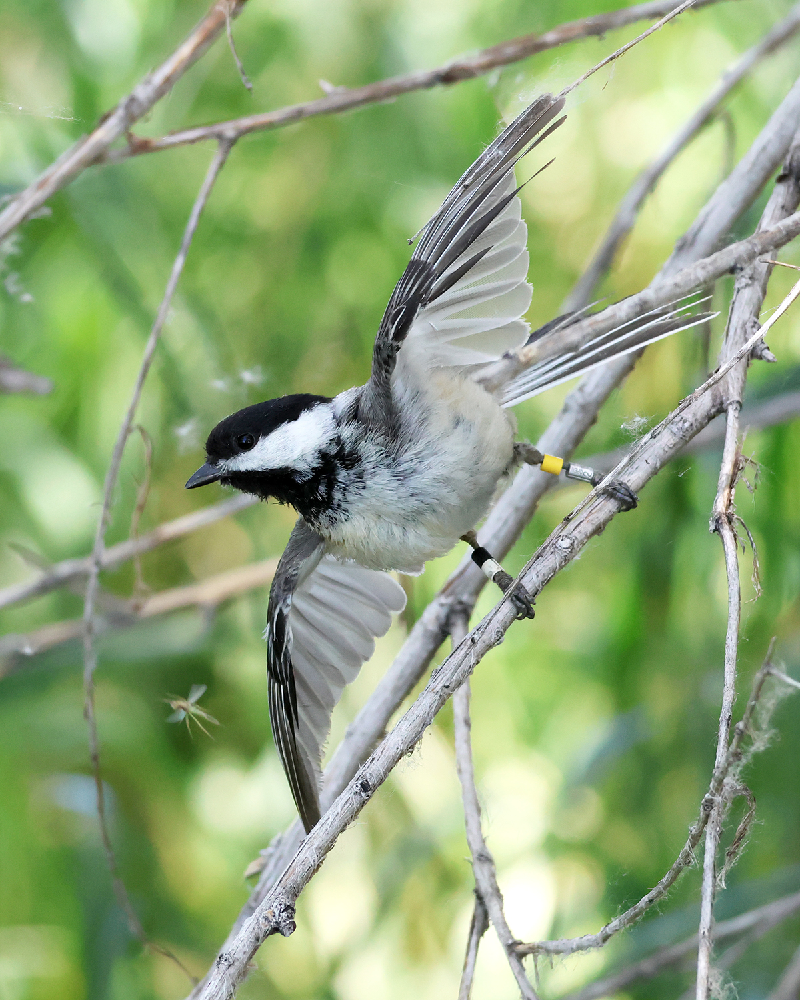
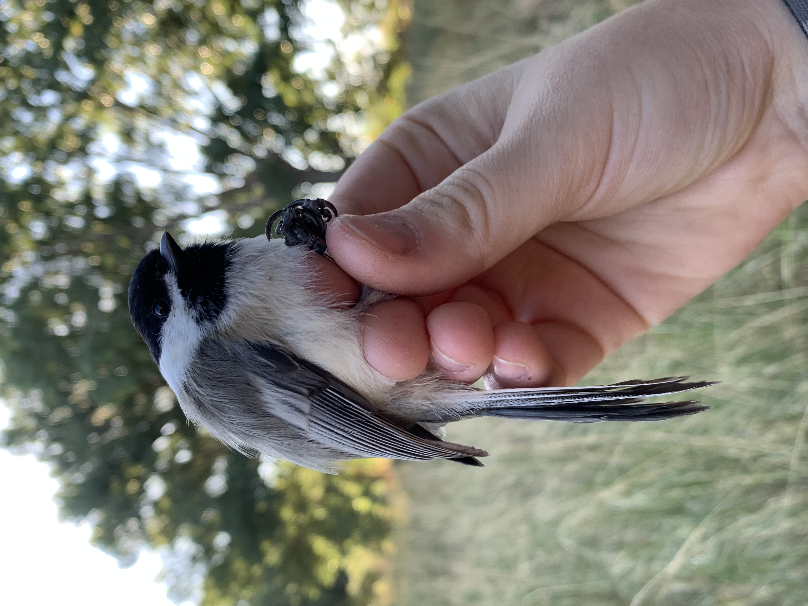

```{r setup, include=FALSE}
knitr::opts_chunk$set(echo = TRUE)
```

[View my MAPS Chickadee Project here](Final_Project/Final_Project_Chickadees.html)

## About Me


Hi! I’m a bird bander working with an ornithologist on a research project that focuses on five songbird species: the American Robin, Black-Capped Chickadee, Song Sparrow, Say’s Phoebe, and House Finch. Our goal is to monitor their survival and productivity over time.

In the field, we set up mist nets and play species-specific calls to safely capture birds. Each individual gets a unique metal band and a custom color band combination so we can identify them from a distance (no need to recapture). This helps us track movements, breeding success, and life histories in a minimally invasive way.

My favorite bird (hands down!) is the chickadee. They pack a whole lot of personality in the cutest little body, and their intelligence is off the charts. I enjoy watching their behavior 
They’ve got such spunky personalities, they’re super smart, and honestly? They’re the cutest little things ever. I could watch them all day.


