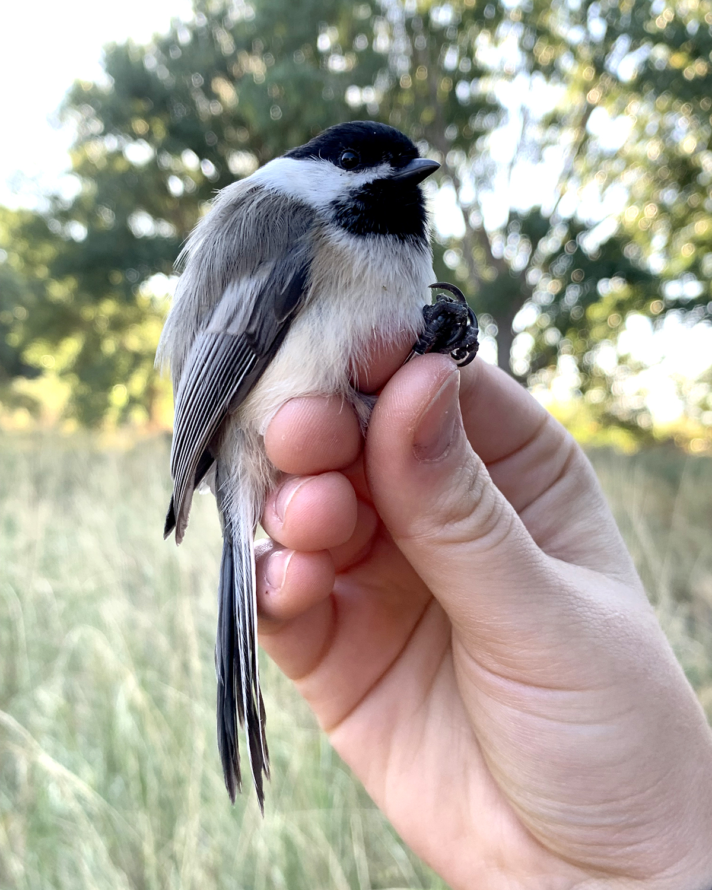

```{r setup, include=FALSE}
knitr::opts_chunk$set(echo = TRUE)
```

[View my MAPS Chickadee Project here](Final_Project/Final_Project_Chickadees.html)

## About Me

Hi! I'm a bird bander working under an ornithologist at SLCC on a research project that focuses on five songbird species: the American Robin, Black-Capped Chickadee, Song Sparrow, Say’s Phoebe, and House Finch. Our goal is to monitor their survival and productivity in differing levels of urbanization over time.

In the field, we set up mist nets and play species-specific calls to safely capture birds. Each individual gets a unique metal band and a custom color band combination so we can identify them from a distance (no need to recapture). This helps us track movements, breeding success, and life histories in a minimally invasive way.

My favorite bird (hands down) is the Black-Capped Chickadee. They pack a whole lot of personality and fight in the smallest body, and their intelligence is off the charts. Below are two images of banded Black-Capped Chickadees from our study.


